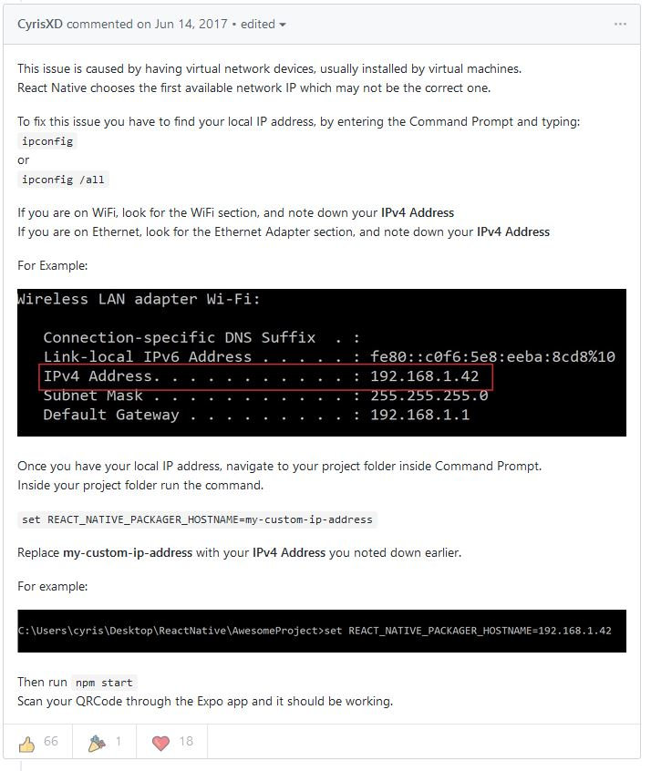

# React Native

## Wifi connectivity issue. See [here](https://github.com/react-community/create-react-native-app/issues/144#issuecomment-308394689)

`set REACT_NATIVE_PACKAGER_HOSTNAME=<my-ipv4-address>`

`set REACT_NATIVE_PACKAGER_HOSTNAME=192.168.10.101`

`yarn global add expo-cli`

## Run in Genymotion

Open Genymotion settings > ADB > Use custom Android SDK tools
Set the folder to `C:\Users\Chidimma\AppData\Roaming\npm\node_modules\expo-cli\node_modules\xdl\binaries\windows\adb`
